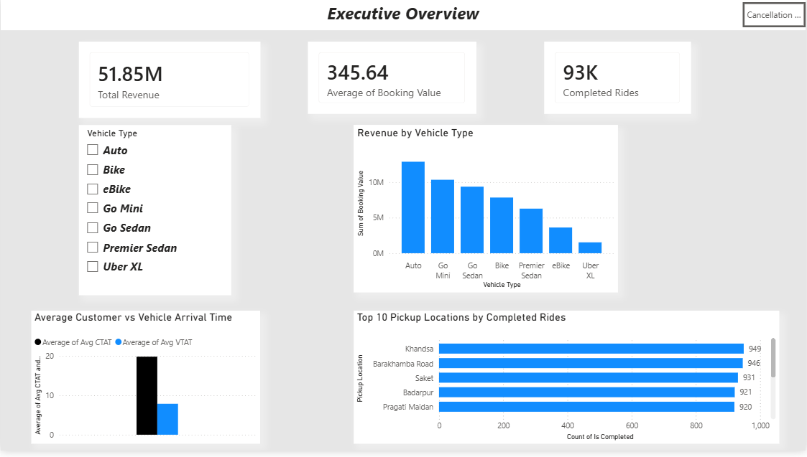

# uber-analytics-powerbi
Interactive Uber Analytics Dashboard built using Microsoft Power BI.

# 🚗 Uber Analytics Dashboard

An interactive Power BI dashboard designed to analyze Uber ride
performance, revenue, completed rides, vehicle performance, and
cancellation patterns.

## 📌 Dashboard Pages

### 1. Executive Overview

The executive dashboard provides an overview of:

- Total Revenue
- Average Booking Value
- Completed Rides
- Revenue by Vehicle Type
- Top 10 Pickup Locations
- Customer vs Vehicle Arrival Time

### 2. Cancellation & Failure Analysis

This page analyzes:

- Total Cancellations
- Customer Cancellations
- Driver Cancellations
- Cancellations by Vehicle Type
- Driver vs Customer Cancellations
- Reasons for Driver Cancellation

## 🛠️ Tools Used

- Microsoft Power BI
- DAX
- Data Visualization
- Data Analysis
- Excel

## 📷 Dashboard Preview

### Executive Overview

### Cancellation & Failure Analysis

## 📁 Project Files

- `Uber_Analytics.pbix` — Power BI project
- `screenshots/` — Dashboard screenshots

## 👨‍💻 Author

Ritvik Sukkal
